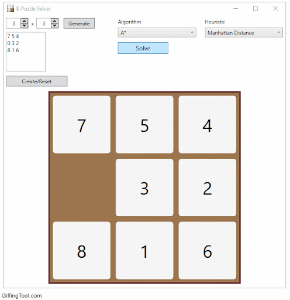

# Eight Puzzle solver using BFS

The eight puzzle is one of the most common puzzles involving sequential movements of numbered tiles that are initially in a random shuffled order. This can be solved using the Breadth First Search algorithm as demonstrated in this code.

## Instructions

To run the file, simply sun as you would normally run a python file. An output file names 'test_case_1_info.txt' will be created for test case 1 and same for test case 2.

To check different samples, the sample cases can be manually changed.